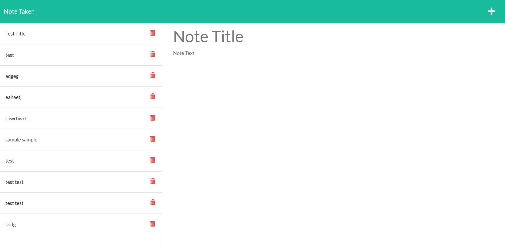

# Note Taker 
[Link to live site](https://samb56.github.io/note-taker/))
  ## table of contents
  - [Description](#description)
  - [Installation](#installation)
  - [Usage](#usage)
  - [License](#license)
  - [Contribution](#contribution)
  - [Tests](#tests)
  - [Questions](#questions)

  ## Description 
  The note taker application is great for saving notes for storing information on an easy to use and minimalistic browser application. Once you enter the default page, press the corresponding button to enter the notes page. From there an intuative system of entering text data is available to save notes for later to keep ones tasks on track or keep reminders visible.
  

  ## Installation 
  Installation consists of downloading the zip file, extracting all of the files, and running the server.js through a terminal of your choice. Once you visit the local port, you will be routed to the inital page of the app.

  ## Usage 
  Once the application is running, using the two labelled text boxes is simple. The operator only needs to enter a title and content of note. Once both fields have been populated, a save button will be visible and once pressed, the data is saved and displayed on the left portion of the screen. The plus icon can be pressed to start a new note. Notes that have been entered will persist to keep information present and within view of the user. 

  ## License 
  the unlicense :
  A license with no conditions whatsoever which dedicates works to the public domain. Unlicensed works, modifications, and larger works may be distributed under different terms and without source code.

  ## Contribution 
  Sam Bergeland

  ## Tests 
  Tests are not available at this time for the application

  ## Questions 
  Find me at Github under [samb56](https://github.com/samb56)

  contact me at:
  [sambergeland@gmail.com](mailto:sambergeland@gmail.com)

